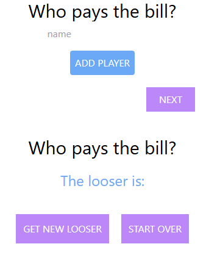

🧾 Who Pays the Bill? – React App

A fun and simple web app that randomly selects someone from a list to "pay the bill." Great for deciding who's the unlucky one in a group!

💡 Features

Add multiple players to a list

Randomly choose one as the "looser" (who pays the bill)

Refresh the chosen player or start over anytime

🛠️ Built With

React (useState)

Tailwind CSS for styling

📸 Preview

📁 File Structure

/src

  └── ToDolist.jsx      # Main component

  └── App.js            # Import and render ToDolist

  └── index.js          # React entry point

📌 Usage

Enter names of players one by one

Click Add Player

When ready, click Next to pick a random player

Click get new looser to shuffle again

Click Start Over to reset the game
